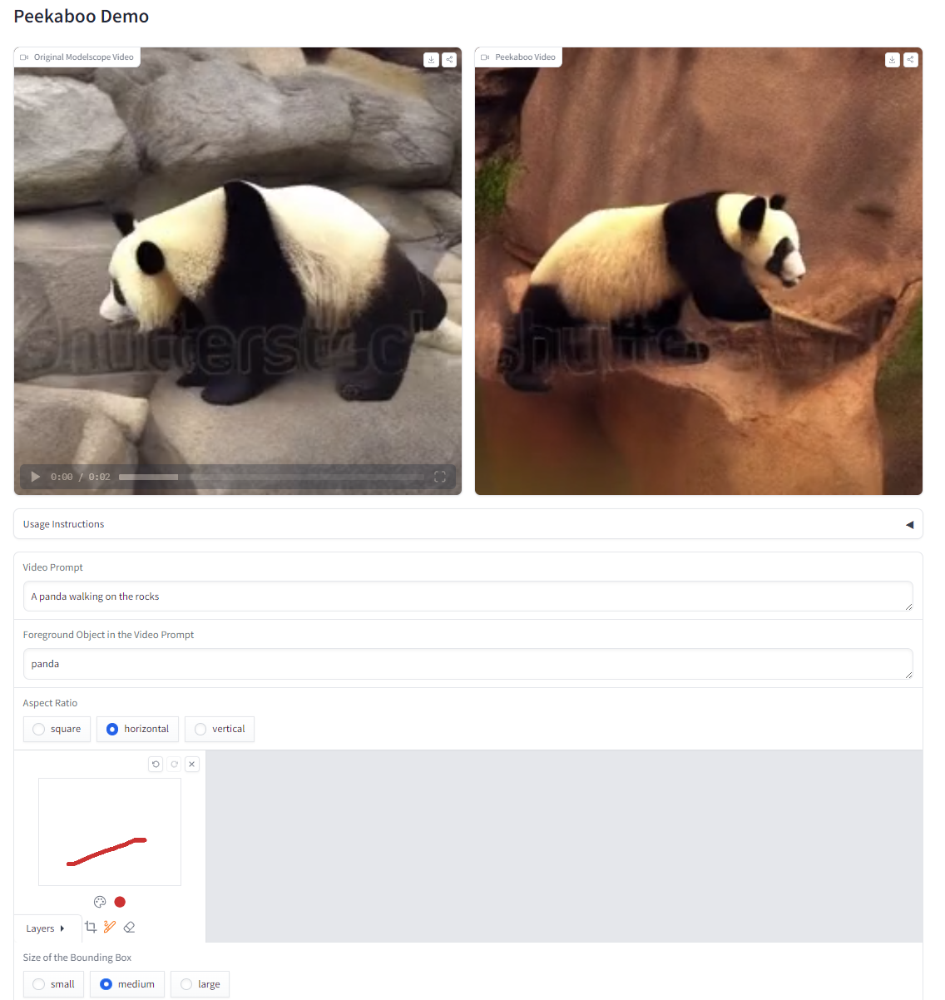

# Peekaboo: Interactive Video Generation via Masked-Diffusion
### [Project Page](https://jinga-lala.github.io/projects/Peekaboo/) | [Paper](https://arxiv.org/abs/2312.07509) | [Data](data/README.md) | [HuggingFace Demo](https://huggingface.co/spaces/anshuln/peekaboo-demo)
PyTorch implementation of Peekaboo, a training-free and zero-latency interactive video generation pipeline<br>

[Peekaboo: Interactive Video Generation via Masked-Diffusion](https://jinga-lala.github.io/projects/Peekaboo/)  
 [Yash Jain](https://jinga-lala.github.io/)<sup>1*</sup>,
 [Anshul Nasery](https://anshuln.github.io/)<sup>2*</sup>,
 [Vibhav Vineet](https://vibhav-vineet.github.io/)<sup>3</sup>,
 [Harkirat Behl](https://harkiratbehl.github.io/)<sup>3</sup><br>
 <sup>1</sup>Microsoft, <sup>2</sup>University of Washington, <sup>3</sup>Microsoft Research  <br>
  \*denotes equal contribution  
  


 |  |  |  |
|:----------------------------------------------------------------------------------------------------------------------:|:-------------------------------------------------------------------------------------------------------------------:|:--------------------------------------------------------------------------------------------------------------------:|
|                        |                     |                      |
| *A Horse galloping through a meadow*                                                                                   | *A Panda playing Peekaboo*                                                                                          | *An Eagle flying in the sky*                                                                                         |


## Quickstart :rocket:

Follow the instructions below to download and run Peekaboo on your own prompts and bbox inputs. These instructions need a GPU with ~40GB VRAM for zeroscope and ~13GB VRAM for modelscope . If you don't have a GPU, you may need to change the default configuration from cuda to cpu or follow intstructions. 

### Set up a conda environment:
```
conda env create -f env.yaml
conda activate peekaboo
```

### Generate peekaboo videos through CLI:
```
python src/generate.py --model zeroscope --prompt "A panda eating bamboo in a lush bamboo forest" --fg_object "panda"

# Optionally, you can specify parameters to tune your result:
# python src/generate.py --model zeroscope --frozen_steps 2 --seed 1234 --num_inference_steps 50 --output_path src/demo --prompt "A panda eating bamboo in a lush bamboo forest" --fg_object "panda"
```

### Or launch your own interactive editing Gradio app:
```
python src/app_modelscope.py 
```


_(For advice on how to get the best results by tuning parameters, see the [Tips](#tips) section)._

## Changing bbox 

We recommend using our interactive Gradio demo to play with different input bbox. Alternatively, editing the `bbox_mask` variable in `generate.py` will achieve similar results.


## Datasets and Evaluation 

Please follow the [README](data/README.md) to download the datasets and learn more about Peekaboo's evaluation.


## Tips

If you're not getting the quality result you want, there may be a few reasons:
1. **Is the video not gaining control or degrading?** The number of `frozen_steps` might be insufficient. The number of steps dictate how long the peekaboo attention mask modulation will act during the generation process. Too less will not affect the output video and too much will degrade the video quality. The default `frozen_steps` is set to 2, but aren't necessarily optimal for each (prompt, bbox) pair. Try:
    * Increasing the `frozen_steps`, or
    * Decreasing the `frozen_steps`
2. Poor video quality: A potential reason could be that the base model does not support the prompt well or in other words, generate a poor quality video for the given prompt. Try changing the `model` or improving the `prompt`.
3. Try generating results with different random seeds by chaning `seed` parameter and running generation multiple times. 
5. Increasing the number of steps sometimes improves results.

## BibTeX

```
@article{jain2023peekaboo,
  title={PEEKABOO: Interactive Video Generation via Masked-Diffusion},
  author={Jain, Yash and Nasery, Anshul and Vineet, Vibhav and Behl, Harkirat},
  journal={arXiv preprint arXiv:2312.07509},
  year={2023}
}
```
## Comments
If you implement Peekaboo in newer text-to-video models, feel free to raise a PR. :smile: 

This readme is inspired by [InstructPix2Pix](https://github.com/timothybrooks/instruct-pix2pix)
